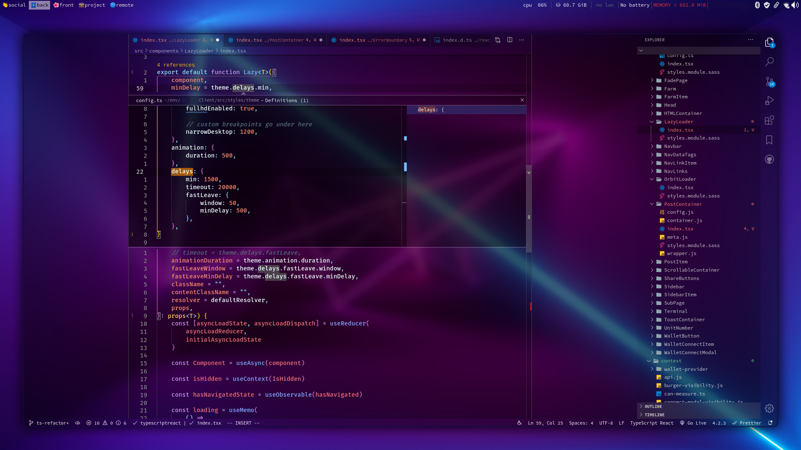

# vscode transparent-theme

## Preconditions

a transparent ready build of vscode like `code-transparent` or `vscode-transparent-insiders` from AUR.  
a window compositor like `picom`. my personal recommendation is `picom-ibhagwan-git` with dual kawase **blur** enabled.  
example looks with the mentioned picom fork would look like this:

## Notes

this is not yet published as a vscode extension.

## How to install

copy everything from this repository to extensions directory of your vscode (e.g. `~/.vscode-oss/extensions/`) and enable by changing your Color Theme.

## Development

open this repository in vscode and edit [the theme file](./themes/transparent-theme-color-theme.json). also don't forget to hit F5 for a live preview of the theme.
